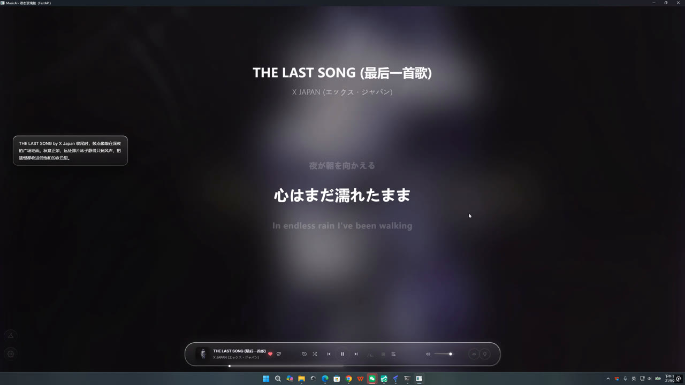
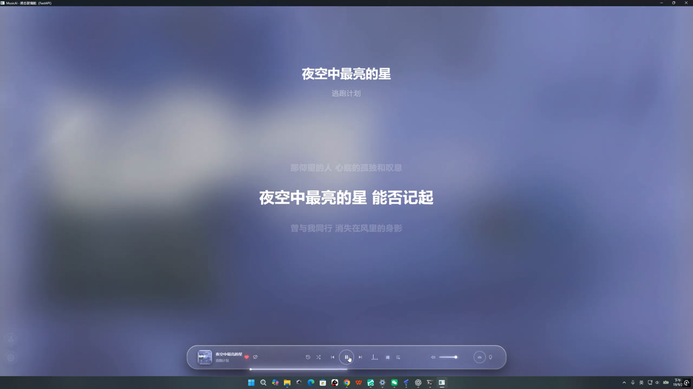
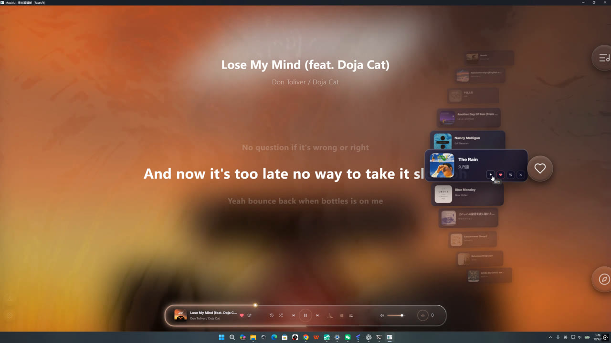
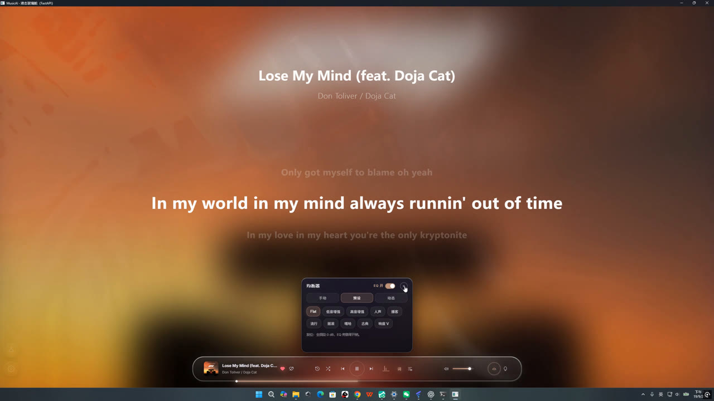

# Radio Intelligence

**A local-first AI radio station.** It turns a personal music library into a continuous broadcast: it programs the music, writes and speaks its own DJ segments in multiple languages, and — quietly, in the background — reads how the music *feels*.

Everything runs on one consumer machine (the reference deployment is a laptop with an RTX 4060, 8 GB): an on-device LLM plays the DJ, an on-device speech stack does the talking, and a music-understanding stack works directly from audio. No cloud account, no API key, and no subscription are required for the core loop.

  

> **This repository is a showcase, not the source distribution.** It hosts the project overview, screenshots and two screen recordings. The source tree, the visual layer's implementation, and the emotion-recognition training protocol are not published. See [Repository scope](#repository-scope).

---

## Demo

Real-time screen recordings of the running application (2560×1440 @ 60 fps, no cuts, no edits):

- **[▶ Demo 1 — 1:34, 29 MB](assets/demo-01.mp4)** — a live broadcast session: the liquid-glass interface, cover-derived ambient background, synchronized lyrics with a next-line preview, and an on-device DJ segment delivered over the music (speech bubble, left). Second half: a Japanese track with its story told by the DJ, lyrics in English and Japanese.

- **[▶ Demo 2 — 2:54, 64 MB](assets/demo-02.mp4)** — continuous broadcasting across very different material: hip-hop, an instrumental film score (handled with a spoken "pure music, please enjoy" notice instead of wrong lyrics), and Chinese pop with synchronized lyrics. The session runs unattended; tracks roll in and out on their own.

Click through to the file page to stream — GitHub shows a built-in player for MP4s in repositories.

## Screenshots

| | |
|---|---|
|  Chinese lyrics, per-line highlighting |  Look-ahead queue cards, like/dislike on hover |
|  Sound presets over the ambient layer |  DJ bubble + Japanese/English lyrics |

---

## How a broadcast works

1. **Queue, not playlist.** The controller keeps a short look-ahead queue (current track + next four) and refills it as tracks roll off. Filling is driven by the recommendation engine in either *continuous* mode (stay near the current sound) or *leap* mode (deliberately jump style).
2. **Narration is prepared before it is needed.** As soon as a track enters the queue, its DJ segment is generated: retrieval (if online) → LLM writing → speech synthesis. By the time the song starts, the audio is already on disk, which is what keeps transitions quiet instead of frantic.
3. **Ducking with honest timing.** The music bed dips when speech starts and is restored only after the narration has *actually finished* — the fade is tied to end-of-playback, not to the non-blocking call that queued it.
4. **Transitions are decided, not fixed.** The controller picks intro / outro / none per transition, and dislikes feed back into what gets queued next.
5. **State goes out over WebSocket.** Every state change is pushed to the UI; the frontend holds no business logic of its own.

## System architecture

```mermaid
flowchart LR
    subgraph FE["Frontend - no framework, no build step"]
        A["HTML/CSS + JS modules"]
        B["WebGL / WebGL2 layers"]
    end
    subgraph BE["Backend - FastAPI @ 127.0.0.1:8765"]
        C["REST + WebSocket"]
        D["Radio bridge / event bus"]
    end
    subgraph AI["On-device intelligence"]
        E["Ollama LLM (DJ)"]
        F["TTS router (MeloTTS / VOICEVOX / Edge)"]
        G["CLAP embedding worker"]
        H["Retrieval fan-out"]
    end
    subgraph ST["Local storage"]
        I[("SQLite")]
        J[("FAISS index")]
    end
    FE <-- "WebSocket + REST" --> BE
    BE --> AI
    AI --> ST
```

The shell is a Qt (PySide6) host that opens the web UI in a QWebEngineView pointed at the local FastAPI server — one process, no browser install, no packaging of a renderer. The controller itself is composed from three mixins (playback orchestration, scheduling, transitions) that share a single state object, so a change made on the playback path is immediately visible to the scheduler.

## Technical features

### Runtime and deployment
- **One process, local endpoint.** FastAPI + Uvicorn on `127.0.0.1:8765` with REST for commands and WebSocket for state; static files, covers and skin assets served from the same app.
- **Local LLM by default.** A Qwen-family model served by Ollama; an OpenAI-compatible remote endpoint stays available as an alternative and is selected by configuration, not by code path. A global lock serializes generation, and prompts are structured to hit the KV cache.
- **Measured, on the developer machine:** one narration segment ≈ 5 s end-to-end after prompt and batch tuning, down from ≈ 23 s — the win came from batching prefill, not from shortening the prompt.
- **VRAM is budgeted, not hoped for.** With an 8 GB card, the LLM keeps residency while TTS and the embedding worker take fixed fractions, and embedding inference is throttled so it never starves the resident model. No CUDA device → everything falls back to CPU.

### Speech
- **Language tags drive routing.** The LLM emits narration with inline `<lang>` tags; a segmenter splits the text, normalizes language codes, and routes each fragment to its engine — MeloTTS (local, GPU) for most languages, VOICEVOX (local headless) for Japanese, cloud Edge-TTS as fallback.
- **Local speech is fast enough to be invisible:** ≈ 0.07× real time on GPU — a minute of speech in roughly four seconds — so synthesis is never the reason a transition feels late.
- **Failure is graceful.** If an engine is missing or a call fails, the router falls through to the next one; if all fail, the narration is shown as text instead of blocking playback.

### Music understanding and retrieval
- **Embeddings from audio, not tags.** LAION-CLAP, 512-d, 10 s windows with a 5 s hop, computed in an **isolated worker process** so CUDA allocations never stall the host process. Vectors are stored half-precision in SQLite and indexed in FAISS (`IndexFlatIP` on normalized vectors, so inner product is cosine).
- **Retrieval fan-out, ordered by cost.** Bing RSS → DuckDuckGo → MusicBrainz → a local `sqlite-vec` corpus, with page fetching and a 30-day cache. A curation gate drops definition pages and boilerplate before anything reaches the prompt — on the test set the definition-page rate fell from 28% to 17% after the gate.
- **Two recommendation modes** over the same index: *continuous* (similarity) and *leap* (deliberate style jump).

### Frontend
- **No framework, no build step.** Hand-written HTML/CSS/JS split into ~10 modules; the UI was progressively carved out of a single large script, which is why the layers are unusually separable.
- **Two rendering mechanisms.** A WebGL shader for the full-screen ambient refraction field, and per-element glass built from SDF displacement maps driven through `backdrop-filter`, with plain blur as fallback.
- **Lyrics** are LRC-parsed with per-line highlighting and a next-line preview; instrumentals are detected and announced rather than forcing empty lyrics.

### Verification and engineering practice
- **~170 end-to-end verification scripts** (`verify_*.py`) serve as per-round acceptance gates; one of them acts as the project-wide regression baseline. They run against the real server and a real browser client rather than asserting on source text.
- **Work is organized in numbered rounds** with archived daily logs — the reason the iteration table below can be written down at all.

---

## Emotion recognition — what it does, and how it behaves

The system reads an emotional trajectory from the audio it plays: not one label per track, but a moving read-out that follows the music over time. It runs **on-device**, at **segment level**, and **offline** — no network and no cloud call are involved.

What that looks like in practice (all of it observable in the recordings above):

- **It follows the song, not the file.** The read-out moves with the music as it plays, so a track that turns halfway through is read as turning, not averaged into a single mood.
- **It survives a style change.** The same read-out is used across Chinese pop, Japanese rock, English hip-hop and instrumental film score without switching modes; the instrumental case is handled explicitly rather than producing a confident but empty answer.
- **It stays stable across a switch.** When one track replaces another, the reading settles into the new song instead of snapping — which is the visible difference between "a mood engine" and "a mood detector".
- **It answers inside the broadcast window.** Per-segment inference adds milliseconds to a pipeline whose visible latency is dominated by speech synthesis (≈ 0.07× real time) and the local LLM (≈ 5 s per segment), so the reading is available while the transition is still happening.
- **It fits next to everything else.** The whole recognition path runs in the memory left over beside a resident LLM on an 8 GB consumer GPU — the deployment budget is part of the specification, not an afterthought.

The research program behind it targets a specific axis of state of the art: **recognition quality under a deployability budget** — good enough to be state of the art *among models that can actually ship* on an 8 GB consumer GPU next to a live LLM, rather than accuracy at any cost on a cluster. For that reason the reported numbers are not reproduced here; they belong to the associated publications.

**How it is built is deliberately not described here** — the model, its training protocol, its label sources, and its measured scores are outside the scope of this repository.

---

## Research: an evaluation-protocol problem worth fixing

This project forced a question that turned out to be more interesting than the answer: **when you compare two frozen representations for a task like this, how much of the "winner" is the representation, and how much is the protocol you measured it with?**

The short version of what we found:

- **A single number hides a curve.** Reporting the gap between two representations at one regularization setting is reporting one point of a path. Move off that point — in particular, trim the coefficient grid at where the two arms actually peak — and the headline effect shrinks dramatically. The reported advantage inherits the extent of the grid someone chose.
- **"Best for each arm" and "the same for both arms" are different questions.** Letting each representation pick its own validation-near-optimal coefficient is not a more generous version of the shared-coefficient comparison; it is a different question, and it can produce comparisons whose sign is not determined at all. Mixing the two is how papers end up disagreeing without anyone being wrong.
- **The solver is part of the experiment.** In a controlled check — same data, same split, same metric — changing *only* the numerical solver moved the set of admissible configurations from less than half of the sampled grid to all of it. Some of what reads as "representation quality" is "which optimizer converged".
- **None of this is specific to music.** The same structure shows up in the NLP/vision spot-checks we ran, which is why this was written up as its own piece of work rather than a footnote in a system paper.

**The takeaway we now apply to ourselves:** never select a representation, or claim one is better, on a single coefficient and a single solver. Report the landscape, or at least the range.

This work has been written up as a manuscript that is **currently under double-blind review**. To keep that review anonymous, this page deliberately gives **no title, no link, no venue, and no reported numbers** — only the problem and the shape of the finding. The full write-up will be linked here once the review process allows it.

---

## Iteration history

Development proceeded in numbered rounds, each with per-round acceptance scripts and archived daily logs. The archive starts at R19 (2026-08-30) and currently reaches R120, with finer sub-rounds inside (e.g. R49-22 … R49-31). Stage numbers below (S1–S8) were assigned when assembling this README; the underlying rounds keep their archive names.

| # | Archive rounds | Period | Theme |
|---|---|---|---|
| S1 | R19–R34 | 2026-08-30 → 09-03 | Player-core stabilization: card UI, playlist flows, cover pipeline, lyrics view, recommendation rebuild |
| S2 | R44–R49 | 09-05 → 09-07 | Navigation rebuild (orbit navigation + side panels) and the project-wide regression gate |
| S3 | R50–R69 | 09-07 → 09-08 | Frontend modularization (one giant script → ten modules), settings, wallpaper engine, EQ, drag physics |
| S4 | R70–R98 | 09-08 → 09-11 | Visual layer & audio semantics: first semantic model, physics layer, calibration chain *(implementation details withheld)* |
| S5 | R99–R104 | 09-11 | Research bootstrap: emotion recognition becomes a first-class sub-project |
| S6 | R105–R120 | 09-11 → 09-22 | Research rounds and production hardening *(round details withheld — unpublished work)* |
| S7 | — ¹ | 09-19 → 09-23 | Real-time hardening: startup stalls, narration latency, retrieval fan-out, TTS/LLM engine selection |
| S8 | — ¹ | 09-28 → 09-29 | Frozen-representation evaluation study → the write-up under review |

¹ Unnumbered in the daily archive; numbered here when this README was assembled.

## Why a compact student head

The recognition path deliberately avoids end-to-end fine-tuning of the audio encoder. A small **student head** is fitted on top of a frozen representation instead:

- **Cost.** Fitting a head takes minutes, not a training run — which is what makes exhaustive protocol checks economically possible at all.
- **Co-existence.** The head shares the frozen encoder with the retrieval path and fits into the VRAM left over next to a resident LLM on the 8 GB card.
- **Swap-and-compare.** Many heads can be evaluated against one cached embedding store, so evaluation questions can be compared honestly without re-embedding the whole library.
- **Response speed.** The head is lightweight, so per-segment inference adds milliseconds to a pipeline whose visible latency is dominated by synthesis and generation. Narration still lands inside the transition window.

## Ongoing & follow-up research

- Extending the evaluation-protocol study: more probe families, more solvers, metric-specific oracles.
- Broadening the recognition program across time scales (a 5 s engineering scale and a 0.5 s research scale) under the same deployability budget.
- Hardening multi-source ingestion and offline resilience.

## Stack summary

| Layer | Choice |
|---|---|
| App shell | PySide6 (Qt) host + QWebEngineView |
| Backend | FastAPI + Uvicorn, REST + WebSocket, `127.0.0.1:8765` |
| Frontend | Hand-written HTML/CSS/JS — no framework, no build step; WebGL/WebGL2 |
| LLM | Local Ollama (Qwen family); OpenAI-compatible endpoint as alternative |
| Speech | MeloTTS (local GPU), VOICEVOX (Japanese), Edge TTS (cloud fallback) |
| Music representation | LAION-CLAP, 512-d, 10 s window / 5 s hop |
| Vector search | FAISS `IndexFlatIP` (cosine), numpy fallback |
| Storage | SQLite — tracks, segments, embeddings, playlists, history, preferences |
| Retrieval | Bing RSS / DuckDuckGo / MusicBrainz / local `sqlite-vec` corpus |
| Audio engine | pygame mixer, two-channel ducking |
| Python | 3.11+ (developed and tested on 3.13) |
| GPU | Designed for an RTX 4060 Laptop 8 GB; runs CPU-only without CUDA |

## Repository scope

- **In this repository:** this README, four screenshots, and two screen recordings. Nothing else.
- **Not published:** the source tree; the visual layer's rendering model, parameterization and tuning data; the emotion-recognition model, training protocol, label sources and measured scores; the identity of the manuscript under review.
- The recordings show the application as it ran on 2026-09-19 and 2026-09-21 on the developer's machine.

## Contact

The maintainer keeps this project personal; identity details are withheld here while the associated manuscript is under double-blind review. If you need to reach them, open an issue on this repository.
